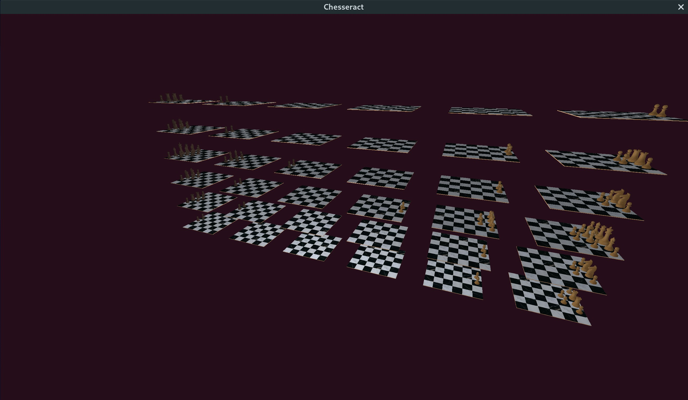

# Chesseract

Chesseract is a multiplayer 4D chess game.

## Running
Check the Releases page for the latest version for your platform.

### Running a multiplayer server
To set up a multiplayer server, use the following command:

    chesseract server -listen 0.0.0.0:36819

Since setting up an account is not yet implemented, it may be conducive to one's enjoyment to pre-populate the internal storage backend with some default accounts. For the `dory` backend, this can be done by supplying it with the `northwind` parameter, like so:

    chesseract server -listen 0.0.0.0:36819 -storage dory:northwind

"Northwind mode" automatically creates two users, `alice` and `bob`.

### Playing in the terminal
To connect to a multiplayer server, use the following command: (replace values with the IP of your multiplayer server and your username)

    chesseract client -server=http://192.168.XX.YY:36819 -username=USER

This connects to a game in your terminal window. To move a piece, enter its current and target position, separated by a space. (E.g.: `e2 e4` or `e7 e5`.)

### OpenGL version
To connect to a multiplayer server, use the following command: (replace values with the IP of your multiplayer server and your username)

    chesseract client -server=http://192.168.XX.YY:36819 -username=USER

This opens an OpenGL window that renders the current chess board. Use W-A-S-D to rotate your view, and enter moves in the terminal window like you would in a terminal-based game. (Note: this is not the intended final gameplay experience.)

## Screenshots

## Building from source
Chesseract is built using the [Go](https://golang.org/) programming language. See their website for installation instructions specific to your platform. Building has been tested with Go 1.17, but some earlier versions probably work fine.

Make sure dependencies are installed, using one of:

    sudo apt-get install build-essential libgl1-mesa-dev
    sudo pacman -Sy base-devel
    xcode-select --install

Clone the repository, and run:

    go get ./...
    go run build.go

This will compile the project and place it in the `build/` directory.

### Development build
By default, the `build.go` script statically embeds all assets in the target binary. To speed up development, the build script can also create a version that loads assets from the file system, enabling one to change local assets without having to recompile. For that, run:

    go run build.go --development --quick

Furthermore, the build script can watch the repository for changes, and recompile as soon as any code changes:

    go run build.go --watch

Finally, the build script can automatically run the binary if compilation was successful. For example, to continuously run a server that gets restarted when the code changes, run:

    go run build.go --development --quick --watch --run -- server -listen=localhost:8080

(When using `--run`, all arguments after `--` are passed to the compiled program.)

## License
This program and its source code are available under the terms of the BSD 3-clause license. Find out what that means here: https://www.tldrlegal.com/l/bsd3

All assets I made for this project (e.g. 3D models) are available under a [CC BY-NC-SA](https://tldrlegal.com/license/creative-commons-attribution-noncommercial-sharealike-4.0-international-(cc-by-nc-sa-4.0)#summary) license.

### Acknowledgements
The GL client is built using the [go-gl](https://github.com/go-gl/gl) library, which is released under the MIT license.
